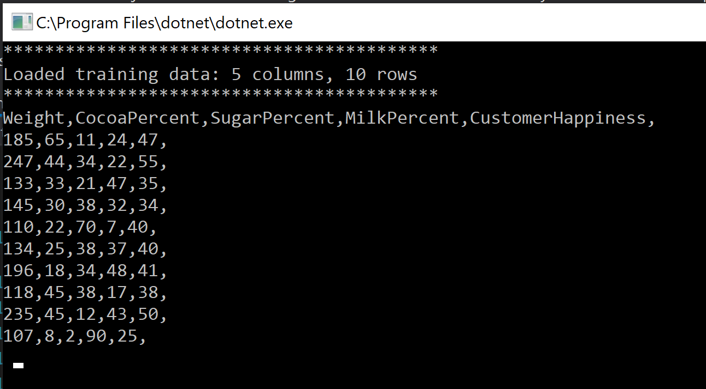
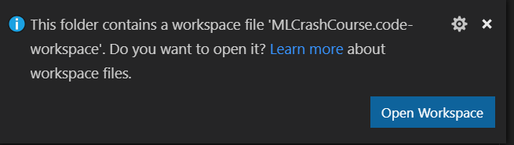

# Introduction to ML.NET

ML.NET is a machine learning framework built for .NET developers. Use your .NET and C# or F# skills to easily integrate custom machine learning into your applications without any prior expertise in developing or tuning machine learning models.

This exercise will get you to setup your environment and give you an introduction to how the rest of the machine learning crash course in ML.NET will work.

## Setting up your environment

These exercises are designed to work best in Visual Studio on Windows, if you already have this installed then you don't need to do anything. Otherwise download and install it [here](https://visualstudio.microsoft.com/vs/). Then you can skip to the **Get the code** section.

The exercises will also work in Visual Studio Code using Mac or Linux or Windows also however there are extra setup steps required if you are not using Visual Studio.

### Getting setup with Visual Studio Code.

If you are going to use Visual Studio Code you will need to follow these steps. If you don't have it on your machine then [download and install vsCode from here](https://code.visualstudio.com/download).

#### Visual Studio Code - C# Extension

To debug a .NET Core application you will need to install the [C# extension for vscode](https://marketplace.visualstudio.com/items?itemName=ms-dotnettools.csharp) by [clicking here](https://marketplace.visualstudio.com/items?itemName=ms-dotnettools.csharp) and clicking on **Install**.

#### .NET Core SDK

You will need to have .NET core installed on your machine. To check if you already have it installed open a command prompt or command line and run the following:

``` bash
dotnet --version
```

If it is installed you will see the following output (the version number may be different):

``` bash
2.2.103
```

If you have received an error or do not see a version number then follow these instructions to install the latest version on your machine:

1. Open the [.NET download page](https://dotnet.microsoft.com/download)
1. Select the tab for your platform `Windows`, `Linux` or `macOS`
1. Click the button `Download .NET Core SDK`
1. Follow the instructions on the page to complete the installation for your platform

#### Get the required building native libraries

In order to run the exercises you will need the required native modules for your platform

**For Windows:**

If you do not have Visual Studio installed, and would like to run the project from Visual Studio Code you need the **Build Tools for Visual Studio 2019** which you can find [here](https://visualstudio.microsoft.com/downloads/#build-tools-for-visual-studio-2017) under the heading "Tools for Visual Studio 2019" and click on **Download** next to **Build tools for Visual Studio 2019**. Once downloaded open and follow the instructions to install.

**For Mac/Linux**

You will need to install PLPlot with your package manager. For example on Mac you will need to run:

``` bash
brew install plplot
```

### Get the code

The exercises are all in the [AISchoolTutorials repository in Github](https://github.com/microsoft/AISchoolTutorials) which you can download using the `Clone or download` button or by running the following command from your command line (if you have git installed):

``` bash
git clone https://github.com/microsoft/AISchoolTutorials
```

**The exercises are found in the folder `MLNETCrashCourse` and all future paths will assume that folder as the root**

## Getting started exercise

Below are the instructions on how to get up and running on this project in both Visual Studio and Visual Studio code. The main other exercises will only include instructions for Visual Studio but using Visual Studio Code is still an option if you would like.

### Using Visual Studio

In order to get you familiar with how these exercises are going to work we have created a simple example application in this folder where you can test that you have everything working correctly. Follow the steps below to complete the introduction exercise.

#### Step 1 - Open the solution in Visual Studio

Locate the solution file in the `MLNETCrashCourse` folder `MLCrashCourse.sln` and open it.

#### Step 2 - Edit and run the project

All of these exercises are C# Console Applications which we will be building out. Throughout the exercises you will be adding code to the existing .cs files in the project to complete the exercise. Then you will need to run the project using the built in VSCode functionality. Let's have a look at how this will work:

1. First we need to install ML.NET. In the solution explorer right click on the project **01.IntroductionToMLNET** and click **Manage NuGet Packages**.
1. Click on the browse tab and in the search box search for **Microsoft.ML**.
1. Click on **Microsoft.ML** and then click on **Install**. Accept the terms and conditions dialog when if it appears.
1. Open up `Program.cs` in this project by clicking on it.
1. Locate the comment `/* Add imports here */` and replace it with the following to import the required ML.NET:

    ```csharp
    using Microsoft.ML;
    using Microsoft.ML.Data;
    ```
    
1. Uncomment the `ChocolateData` class at the end of the file.
1. Locate the line inside the `Main` method that reads `Add code here`.
1. Now we are going to load up our data set and print out a preview of the data. Replace this line with the following code to print out 10 rows of the training data to the console:

    ```csharp
    MLContext mlContext = new MLContext();

    // Read the training data from a file
    IDataView trainingDataView = mlContext.Data.LoadFromTextFile<ChocolateData>(path: "data/chocolate-data.txt", hasHeader: true);

    var preview = trainingDataView.Preview(10);
    Console.WriteLine($"******************************************");
    Console.WriteLine($"Loaded training data: {preview.ToString()}");
    Console.WriteLine($"******************************************");
    foreach (var columnInfo in preview.ColumnView)
    {
        Console.Write($"{columnInfo.Column.Name},");
    }
    Console.WriteLine();
    foreach (var rowInfo in preview.RowView)
    {
        foreach (var row in rowInfo.Values)
        {
            Console.Write($"{row.Value},");
        }
        Console.WriteLine();
    }
    ```

    > **Note:** We'll review this with more detail in the next exercises.

1. Make sure to save the file.
1. Right click on the project **01.IntroductionToMLNET** in the solution explorer and click **Set as StartUp project**
1. Hit F5 to run the project.
1. You should see the first 10 records of the data printed to the console.



### Using Visual Studio Code

In order to get you familiar with how these exercises are going to work we have created a simple example application in this folder where you can test that you have everything working correctly. Follow the steps below to complete the introduction exercise.

#### Step 1 - Open the workspace in Visual Studio Code

The first step is to open the workspace in Visual Studio Code. To do this follow these steps:

// TODO add the actual repo URL and cloning instructions
1. Clone or download this repository to a local directory on your machine 
1. Open Visual Studio Code
1. Click on `File`>`Open Folder`
1. Locate and select the folder that you cloned or downloaded this repository into
1. In the bottom right of Visual Studio Code you will see a a button `Open Workspace`

    

>**Note:** For the other exercises you will need to have the workspace opened already as described in this step

#### Step 2 - Select the correct project to debug

Since there are multiple projects in this workspace you will need to select the correct workspace for the exercise you are working on. In this case it is `01.IntroductionToMLNET` but for the other exercises this will be described at the beginning. Follow these steps to select the correct project:

1. Select the debug tab from the leftmost sidebar, which is fourth icon from top to bottom.
1. In the top left of Visual Studio Code you will see the word DEBUG followed by a dropdown with a list of options, which should read `.NET Core Launch (console) (01.IntroductionToMLNET)` at this moment.
1. You will be selecting the other projects this way in the following steps making sure to select the `Launch` option, for now let's just stay with `01.IntroductionToMLNET`.

>**Note:** For the other exercises you will need to select the right project, for example linear regression will mean selecting `NET Core Launch (console) (02.LinearRegression)`.

#### Step 3 - Edit and run the project

>**Note:** If you see any errors about missing dependencies then Select **Terminal -> New Terminal** from the top.

All of these exercises are C# Console Applications which we will be building out. Throughout the exercises you will be adding code to the existing .cs files in the project to complete the exercise. Then you will need to run the project using the built in VSCode functionality. Let's have a look at how this will work:

1. Select **Terminal -> New Terminal** from the top Menu.
1. Select `01.IntroductionToMLNET` and a new terminal will be displayed.
1. Type `dotnet add package Microsoft.ML -v 0.11.0` and press enter. Wait for the package installation to finish.
1. Open up `Program.cs` in this project by clicking on it.
1. Locate the comment `/* Add imports here */` and replace it with the following to import the required ML.NET:

    ```csharp
    using Microsoft.ML;
    using Microsoft.ML.Data;
    ```
    
1. Uncomment the `ChocolateData` class at the end of the file.
1. Locate the line inside the `Main` method that reads `Add code here`.
1. Replace this line with the following code to print out 10 rows of the training data to the console:
    ```csharp
    MLContext mlContext = new MLContext();

    // Read the training data from a file
    IDataView trainingDataView = mlContext.Data.LoadFromTextFile<ChocolateData>(path: "data/chocolate-data.txt", hasHeader: true);

    var preview = trainingDataView.Preview(10);
    Console.WriteLine($"******************************************");
    Console.WriteLine($"Loaded training data: {preview.ToString()}");
    Console.WriteLine($"******************************************");
    foreach (var columnInfo in preview.ColumnView)
    {
        Console.Write($"{columnInfo.Column.Name},");
    }
    Console.WriteLine();
    foreach (var rowInfo in preview.RowView)
    {
        foreach (var row in rowInfo.Values)
        {
            Console.Write($"{row.Value},");
        }
        Console.WriteLine();
    }
    ```
    > **Note:** We'll review this with more detail in the next exercises.

1. Make sure to save the file.
1. Hit F5 to run the project.
1. You should see the first 10 records of the data printed to the console.

