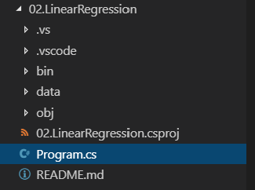
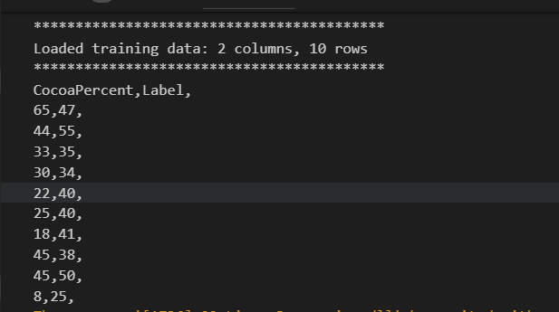

# Linear Regression

> **Note:** If you have not already setup your environment please refer to the
> [Introduction to ML.NET Readme here](../01.IntroductionToMLNET/README.md)

We want to know how to make our chocolate-bar customers happier. To do this, we need to know which chocolate bar features predict customer happiness. For example, customers may be happier when chocolate bars are bigger, or when they contain more cocoa.

We have data on customer happiness when eating chocolate bars with different features. Lets look at the relationship between happiness and cocoa percentage.

> **Note:** Make sure that in the solution explorer you right click on **02.LinearRegression** and select **Set as StartUp project**. If you are using Visual Studio Code, you may need to open a terminal to the `02.LinearRegression` folder and run `dotnet restore`.

## Step 1 - Looking at our data

First, lets have a look at our data. We are going to be using a reader to read data from a csv file that is located in the data folder in this project.

1. Open `Program.cs` in this project by double clicking on it in the explorer.

    

1. First we need to define the path of the data file that we are going to use in the exercises. **Locate the comment that reads `/* Add data path code */` and replace with the following code**:

    ```csharp
    private static readonly string TrainDataPath = Path.Combine(Environment.CurrentDirectory,"data", "chocolate-data.txt");
    ```

1. The next step is to add the following code the create the [MLContext](https://docs.microsoft.com/en-us/dotnet/api/microsoft.ml.mlcontext?view=ml-dotnet), which is the starting point of all ML.NET projects. It provides a mechanism to log, as well as the entry point for training, prediction, model operations and more. **Locate the comment that reads `/* Add ML Context */` and replace with the following code**:

    ```csharp
    // Create MLContext to be shared across the model creation workflow objects
    MLContext mlContext = new MLContext();
    ```
    > **Note:** You can also copy the complete solution from [Complete Examples](../00.CompleteExamples/02.LinearRegression)

1. Now we are going to create a [TextLoader](https://docs.microsoft.com/en-us/dotnet/api/microsoft.ml.data.textloader?view=ml-dotnet) which we will use to load a text file into a [IDataView](https://docs.microsoft.com/en-us/dotnet/api/microsoft.ml.idataview?view=ml-dotnet), the fundamental data pipeline type in ML.NET. Notice how we are defining the column `CocoaPercent`, its data type and the column number in the file (1).  **Locate the comment that reads `/* Create TextLoader */` and replace with the following code**:

    ```csharp
    // Define a reader: specify the data columns, types, and where to find them in the text file
    var reader = mlContext.Data.CreateTextLoader(
        columns: new TextLoader.Column[]
        {
            new TextLoader.Column("CocoaPercent", DataKind.Single, 1),
            new TextLoader.Column("Label", DataKind.Single, 4)
        },
        // First line of the file is a header, not a data row
        hasHeader: true
    );
    ```
    > **Note:** ML.NET algorithms use default column names when none are specified. All trainers have a parameter called `featureColumnName` for the inputs of the algorithm and when applicable they also have a parameter for the expected value called `labelColumnName`. By default those values are `Features` and `Label` respectively.

1. Finally we are going load the data into an `IDataView` using the `TextLoader` we created. Then we can use the `IDataView` method `Preview` to extract the 'head', in this case 10 rows, into a variable `preview` and write it out to the console. **Locate the comment that reads `/* Print out data */` and replace with the following code**:

    ```csharp
    // Create a preview and print out like a CSV
    var trainingData = reader.Load(TrainDataPath);
    var preview = trainingData.Preview(10);
    Console.WriteLine($"******************************************");
    Console.WriteLine($"Loaded training data: {preview.ToString()}");
    Console.WriteLine($"******************************************");
    foreach (var columnInfo in preview.ColumnView)
    {
        Console.Write($"{columnInfo.Column.Name},");
    }
    Console.WriteLine();
    foreach (var rowInfo in preview.RowView)
    {
        foreach(var row in rowInfo.Values) {
            Console.Write($"{row.Value},");
        }
        Console.WriteLine();
    }
    ```

1. Make sure to save the file.
1. Run the project by pressing F5.
1. Observe the details about the loaded training data in the console window that launches. It should be similar to the following



## Step 2 - Building a model and running a prediction

Now, we are going to be using the ML.NET regression trainer `PoissonRegression` to train the model to make a prediction of customer happiness based on the cocoa percentage.

1. The first thing you will need to do in any ML.NET project is to create a pipeline. The general idea here is that you create a 'chain' operations like data loading, transformations and model building together to create a 'pipeline'. In this case we are creating a pipeline using the `PoissonRegression` algorithm, which is a type of Linear regression; we are concatenating our columns and then appending a `PoissonRegression` model to the end. Locate the comment that reads `/* Create pipeline */` and replace with the following code:

    ```csharp
    // Apply standard ML.NET normalization to the raw data
    var pipeline =
        // Specify the PoissonRegression regression trainer
        mlContext.Transforms.Concatenate("Features", "CocoaPercent")
        .Append(mlContext.Regression.Trainers.PoissonRegression());
    ```
    > **Note:** We concatenate the input parameters in a new column called `Features`.

1. The next step is to train our model by passing our training data to the method `Fit`. Locate the line that reads `/* Train the model */` and replace with the following code:

    ```csharp
    // Train the model
    var model = pipeline.Fit(trainingData);
    ```

1. The final step is to use the model to get a prediction. In this case we do this by calling the method `CreatePredictionEngine` to generate our final prediction engine. Then we can pass in a `chocolateInput` object with a cocoa percentage of `65` and see what the model predicts for customer happiness. Locate the comment that reads `/* Get the prediction */` and replace it with the following code:

    ```csharp
    // Use the trained model for one-time prediction
    var predictionEngine = model.CreatePredictionEngine<ChocolateInput, ChocolateOutput>(mlContext);

    // Obtain the prediction
    var prediction = predictionEngine.Predict(new ChocolateInput
    {
        CocoaPercent = 65, // trained value 65
    });

    Console.WriteLine($"*************************************");
    Console.WriteLine($"Predicted customer happiness: {prediction.CustomerHappiness:0.##}");
    Console.WriteLine($"*************************************");
    ```

1. Make sure to save the file.
1. Run the project by pressing F5.
1. Observe the predicted customer happiness for the established cocoa percentage in the console window that launches. This number represents predicted customer happiness based on the input value of 65% of cocoa.


## Step 3 - Graphing prediction data

We want to know which chocolate bar features make customers happy. Here we are going to generate a graph using the data at the training data

1. We already have an Util class that know how to generate the graph so we are going to add the code to call this Util. Locate the comment that reads `/* Generate graph */` and replace with the following code:

    ```csharp
    // Generate graph with training data
    ChartGeneratorUtil.PlotRegressionChart(new PlotChartGeneratorModel
    {
        Title = "Chocolate Consumer Happiness Prediction",
        LabelX = "Cocoa Percent",
        LabelY = "Customer Happiness",
        ImageName = "CocoaPercentToHappiness.png",
        PointsList = new List<PlotChartPointsList>
                {
                  new PlotChartPointsList { Points = ChartGeneratorUtil.GetChartPointsFromFile(TrainDataPath, 1, 4).ToList() }
                },
        MaxLimitY = ChartGeneratorUtil.GetMaxColumnValueFromFile(TrainDataPath, 4) + 10,
    });
    ```
    > **Note:** The `ChartGeneratorUtil.GetChartPointsFromFile` method received the path of the training data, column indexes of the cocoa percentage and the happiness values in the file to generate the points to print in the graph.

1. Make sure to save the file.
1. Run the project by pressing F5.
1. Generated image will be open with the default software in your computer. Graph should look like the following example:


## Step 4 - Using a different feature for prediction

Finally, we are going to be testing the model with another property. In this case we are going to be comparing costumer happiness to bar size, or bar `Weight` as the data conveys.

1. First lets try changing the column that we are going to use for predictions from `CocoaPercent` to `Weight` (the weight of the chocolate). **Locate the line where we select the CocoaPercentage column from the csv**:

    ```csharp
    new TextLoader.Column("CocoaPercent",DataKind.Single,1),
    ```

    and replace with the following to match the new property:

    ```csharp
    new TextLoader.Column("Weight",DataKind.Single,0),
    ```

1. Locate the other 3 places where we use `CocoaPercent` and replace with the word `Weight`.
1. Locate the following line `CocoaPercent = 65, // trained value 65` and replace it with the following code:
    ```csharp
    Weight = 160, // trained value 160
    ```
1. Locate the code that generates the graph and replace it with the following code:

    ```csharp
    // Generate graph with training data
    ChartGeneratorUtil.PlotRegressionChart(new PlotChartGeneratorModel
    {
        Title = "Chocolate Consumer Happiness Prediction",
        LabelX = "Weight",
        LabelY = "Customer Happiness",
        ImageName = "WeightToHappiness.png",
        PointsList = new List<PlotChartPointsList>
                {
                  new PlotChartPointsList { Points = ChartGeneratorUtil.GetChartPointsFromFile(TrainDataPath, 0, 4).ToList() }
                },
        MaxLimitX = ChartGeneratorUtil.GetMaxColumnValueFromFile(TrainDataPath, 0) + 10,
        MaxLimitY = ChartGeneratorUtil.GetMaxColumnValueFromFile(TrainDataPath, 4) + 10,
    });
    ```
1. Run the project by pressing F5.
1. Observe the new predicted customer happiness for the established bar weight in the console window that launches.
