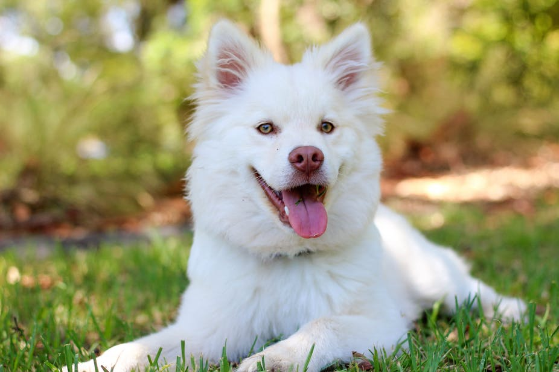

# StoryTelling

Learn how to build and train a TensorFlow model using a Deep Learning Virtual Machine (DLVM) and create predictions. Discover how our Artificial Intelligence develops stories about the image you want.

## Introduction

Learn about the libraries used in this lab and how to set up your environment.

### A) Process Flow

#### Visual Semantic Embedding

The first part of the project is the one that transforms the input picture into captions. Captions describes briefly the picture as is shown in the example below.

*A white dog that is looking at a frizbee*
*Small white dog with green and white boe tie on*
*A white dog with black spots is sitting on the grass*

The model employed to generate this captions is composed by two different networks. First one is a convolutional neural network in order to extract a set of feature vectors refered as annotation vectors.

The second part of the model is a long short-term memory (LSTM) network that produces a caption by generating one word at every time step conditioned on a context vector, the previous hidden state and the previously generated words.

#### Skipthought Vectors

Skipthought Vectors by R. Kiros is a model that generates generic sentences representations that can be used in different task. In particular for this project the idea is train an encoder-decoder model that tries to reconstruct the surrounding sentences of an encoded passage using the continuity of text from books. 
 

 The model is an ecoder-decoder model. The encoder is used to map a sentence into a vector. The decoder then conditions on this vector to generate a translation for the source sentence.

The vocaulary used has been expanded using google news pretrained vectors by generating a linear regressor that maps words in the founded in books vocabulary to words in this vectors.

#### Style shifting

Attending to skipthoughts functioning if the sentences given to the encoder from the VSE are short descriptive sentences the final output will be a short sentence. For that reason if the desired output is a more literary passage we need to make a style shifting.
That means to operate with skipthought vectors representations to set the input to the characteristics we want to induce in the output. The operation is the following:

Skipthoughts Decoder Input = Encoded Captions of the picture - Average All Captions Encoded + Encoded Passages with similar lenght and features as the output we expect 

### B) Dependencies

This lab is based on [Pix2Story](https://www.ailab.microsoft.com/), an AI that generates stories about an image in different literary genres. Based on the paper [Skip-Thought Vectors](https://arxiv.org/pdf/1506.06726.pdf) by Ryan Kiros, Yukun Zhu, Richard S. Zemel, Antonio Torralba, Raquel Urtasun, Sanja Fidler and in the results in the git [neural-storyteller](https://github.com/ryankiros/neural-storyteller) by Ryan Kiros, Yukun Zhu and Michael J. Lumpe.

We'll use **Conda** to handle the lab dependencies. Conda is apackage, dependency and environment management for Python (supports other languages). This lab dependencies are:

* `Python 3.5`
* `Theano 1.0.2`
* `pygpu 0.7.6`
* `Lasagne 0.2.dev1`

**environment.yml** (conda environment YAML file):

* `azureml-defaults`
* `scikit-image`
* `nose`
* `nltk`
* `Cython`
* `sklearn`
* `Pillow`
* `azureml-sdk`
* `opencv-python==3.3.0.9`
* `scipy`

### C) Setup your Azure subscription

This lab **requires** an Azure subscription.

If you need a new Azure subscription, then there are a couple of options to get a free subscription:

1. The easiest way to sign up for an Azure subscription is with VS Dev Essentials and a personal Microsoft account (like @outlook.com). This does require a credit card; however, there is a spending limit in the subscription so it won't be charged unless you explicitly remove the limit.
    * Open Microsoft Edge and go to the [Microsoft VS Dev Essentials site](https://visualstudio.microsoft.com/dev-essentials/).
    * Click **Join or access now**.
    * Sign in using your personal Microsoft account.
    * If prompted, click Confirm to agree to the terms and conditions.
    * Find the Azure tile and click the **Activate** link.
1. Alternatively, if the above isn't suitable, you can sign up for a free Azure trial.
    * Open Microsoft Edge and go to the [free Azure trial page](https://azure.microsoft.com/en-us/free/).
    * Click **Start free**.
    * Sign in using your personal Microsoft account.
1. Complete the Azure sign up steps and wait for the subscription to be provisioned. This usually only takes a couple of minutes.

### D) Create a Deep Learning Virtual Machine

The Deep Learning Virtual Machine is a specially configured variant of the [Data Science Virtual Machine (DSVM)](https://docs.microsoft.com/en-us/azure/machine-learning/data-science-virtual-machine/overview) designed to use GPUs to more efficiently train deep neural networks.

1. Log into the [Azure Portal](https://portal.azure.com)(portal.azure.com).
1. Click **Create Resource [+]**  from the left menu and search for `Deep Learning Virtual Machine`.
1. Select the first result and click the **Create** button.
1. Provide the required information:
    * Name: `ai-labs-pix2story-<your initials>`.
    * OS Type: `Linux`.
    * Set the username and password.
      > Note: keep these credentials in a Notepad as we'll need them later to connect to the VM.

    * Select your preferred subscription.
    * Create a new resource group: `ai-labs-<your initials>`.
    * Location: `West US 2`.

        > Note: for this lab we'll use a Deep Learning VM which requires NC class machines that are only available in EAST US, NORTH CENTRAL US, SOUTH CENTRAL US, and WEST US 2.

1. Click **OK** to continue with the **Settings** section.
1. Select `NC6` for the VM size.
1. Continue until the last section **Buy**.
1. Click **Create** to start the provisioning.
   > Note: a link is provided to the terms of the transaction. The VM does not have any additional charges beyond the compute for the server size you chose in the size step.

1. The provisioning should take about 10 minutes. The status of the provisioning is displayed int the Azure portal.
1. Once provisioning is complete, you will see a **Deployment succeeded** notification.
1. Go to **All Resources** in the left pane and search for the new resource: `ai-labs-pix2story-<your initials>`.
1. Click on the first result to open it.
1. Copy the `Public IP address` into Notepad.
   > Note: we'll need this value later on to connect to the VM.  

## Train a model using a Deep Learning VM (DLVM)

Once you have provisioned your Deep Learning Virtual Machine (DLVM), you can start building your encoding-decoding models. For this lab we will use TensorFlow to create a encoder and a decoder based on your texts.

### A) Download the lab materials

Follow the following steps to download the sample code provided for this lab. It includes the scripts to train and test your model.

1. Login to your VM:
    * Open a command prompt and run `ssh <username>@<dlvm public ip address>`
      > Note: the **username** is the one you indicated when you created the DLVM.

    * After that, you'll be prompted for your password. Type the one you used during the DLVM setup.

1. You should see a welcome message in your terminal indicating that you have successfully connected to the DLVM.
1. Clone this repo to your VM using the command `git clone <repository url> pix2story-lab`.
    > Alert: make sure to put your code into `<your home>\pix2story-lab`.

### B) Download the training data

After connecting to the DLVM, you'll need to prepare your environment and download the texts for the training data. The quality of the source material will impact your outputs. Good sources might include [Smashwords](https://www.smashwords.com/books/category/892/downloads/0/free/any/) and [Project Gutenberg](http://www.gutenberg.org/ebooks/search/?query=s.Adventure+%21bsxAdventure&start_index=1). Make sure you review and understand the site’s Terms and Conditions before proceeding.

1. Update your system packages: `sudo apt-get update`.
1. Move to your lab directory: `cd pix2story-lab`.
1. Download the [Google News vectors]( https://github.com/mmihaltz/word2vec-GoogleNews-vectors)(GoogleNews-vectors-negative300.bin) to the `models` folder.
1. Download the following files from the [git neural-storyteller](https://github.com/ryankiros/neural-storyteller) by Ryan Kiros, Yukun Zhu and Michael J. Lumpe:
    * coco_embedding.npz
    * coco_embedding.npz.dictionary.pkl
    * coco_embedding.npz.pkl
    * coco_train_caps.txt
    * vgg_weights.npy
    * caption_style.npy
    * swift_style.npy
    > Note: all these files should be placed in the **models** folder.

1. From your lab directory (pix2story-lab), execute the command: `conda env create --file environment.yml`.
	> Note: This will run **conda** to install the dependencies.
1. Once it is finished, run the following command to activate the **conda** environment: `source activate storytelling`
1. Run scrapy to get the training data:
	* `cd source/utils/books_scrapping/`
	* `python ./run_scraper.py`
	* Check the fetched data: `du -sh ../../../books/`
		> Note: this should output ˜17MB of data.

### C) Train and create the model

Run training.py to train a encoder, generate necessary files and train a decoder based on your texts.

1. Go back to the source directory: `cd ../.. && ls -lh`
    > Note: this is the source directory with the scripts to train and test the model.

1. Run the training script: `THEANO_FLAGS='floatX=float32' python training.py`
   > Alert: the training lasts for about 4 hours, so consider using a tool like [screen](https://linuxize.com/post/how-to-use-linux-screen/) so you can keep your process running if the ssh connection fails.
   > Note: this script will train a encoder, generate necessary files and train a decoder based on your texts.
   > Note: if you want to re-run the training you should remove the generated artifacts from the previous run. Execute the `models/clean.sh` script before running the training again.

### D) Test your model

Let's run a script to test our model locally.

1. Type: `cat score.py`. **Review** the content of this file, this will pass an image to the **generate** script to send it to the local models and generate the stories.

1. Execute: `python score.py`. Wait while the prediction is complete.
   > Note: this will output the prediction with the generated story.

*Media Elements and Templates. You may copy and use images, clip art, animations, sounds, music, shapes, video clips and templates provided with the sample application and identified for such use in documents and projects that you create using the sample application. These use rights only apply to your use of the sample application and you may not redistribute such media otherwise.*