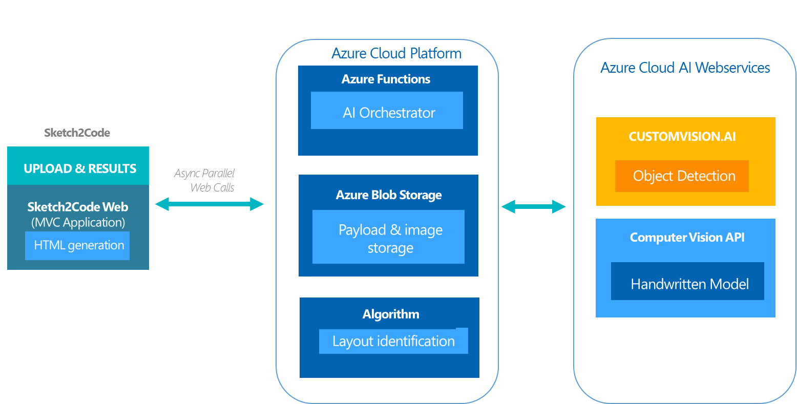
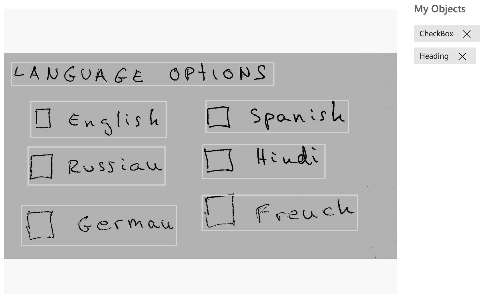
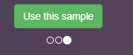

# Sketch2Code

## Description
This lab will guide you through the process of using Azure Custom Vision to create a solution that is capable of transforming a handwritten user interface into valid HTML markup.

## Process Flow
The process of transformation is detailed as follows:
1.	The user uploads an image through the website.
2.	A custom vision model predicts what HTML elements are present in the image and their location.
3.	A handwritten text recognition service reads the text inside the predicted elements.
4.	A layout algorithm uses the spatial information from all the bounding boxes of the predicted elements to generate a grid structure that accommodates all elements.
5.	An HTML generation engine uses all this information to generate HTML markup code reflecting the result.

## Architecture
The Sketch2Code solution is made up of the following components:
-	A Microsoft Custom Vision Model: This model has been trained with images of different handwritten designs tagged with the information of common HTML elements such as buttons, text boxes and images.
-	A Microsoft Computer Vision Service: Provides OCR character recognition capabilities that can turn handwritten images into digital text.
-	An Azure Blob Storage: All steps involved in the HTML generation process are stored, including the original image, prediction results, and layout grouping information.
-	An Azure Function: Serves as the backend entry point that coordinates the generation process by interacting with all the services.
-	An Azure web site: A frontend application that enables the upload of a new design and outputs the generated HTML results.
These components form the architecture as follows:



## Setup your environment

### A) Setup your Azure subscription

This lab **requires** an Azure subscription. If you delete the resources at the end of the session, total charges will be less than $1 so we strongly recommend using an existing subscription if available.

If you need a new Azure subscription, then there are a couple of options to get a free subscription:

1. The easiest way to sign up for an Azure subscription is with VS Dev Essentials and a personal Microsoft account (like @outlook.com). This does require a credit card; however, there is a spending limit in the subscription so it won't be charged unless you explicitly remove the limit.
    * Open Microsoft Edge and go to the [Microsoft VS Dev Essentials site](https://visualstudio.microsoft.com/dev-essentials/).
    * Click **Join or access now**.
    * Sign in using your personal Microsoft account.
    * If prompted, click Confirm to agree to the terms and conditions.
    * Find the Azure tile and click the **Activate** link.
1. Alternatively, if the above isn't suitable, you can sign up for a free Azure trial.
    * Open Microsoft Edge and go to the [free Azure trial page](https://azure.microsoft.com/en-us/free/).
    * Click **Start free**.
    * Sign in using your personal Microsoft account.
1. Complete the Azure sign up steps and wait for the subscription to be provisioned. This usually only takes a couple of minutes.

### C) Download the lab materials
Download the sample code provided for this lab, it includes the following:
* Training images
* Training label data
* An Azure orchestrator function
* The Sketch2Code frontend app

To Download:  
1. Click **Clone or download** from this repo.
1. You can clone the repo using git or click **Download ZIP** to directly download the code from your browser.

### D) Create a Cognitive Services resource.

We'll use an Azure Cognitive Service resource to access the Custom Vision and Computer Vision APIs.

1. Log into the [Azure Portal](https://portal.azure.com)(portal.azure.com).
1. Click **Create Resource [+]**  from the left menu and search for `Cognitive Services`.
1. Select the first result and click the **Create** button.
1. Provide the required information:

    * Name: `sketch2code-vision-<your initials>`.
    * Location `(US) West US 2`
    * Pricing tier: `S0`.
    * Create a new resource group: `sketch2code-<your initials>`.
    * Check the `I confirm I have read and understood the notice below.`

1. Click **Create** to create the resource and deploy it. This step might take a few minutes.
1. Once the deployment is completed you will see a **Deployment succeeded** notification.
1. Go to **All Resources** in the left pane and search for the new resource: `sketch2code-vision-<your initials>`.
1. Click on the first result to open it.
1. Click on the **Quick start** option from the menu.
1. Copy the **Endpoint** value into **Notepad**.
1. Copy the **Key 1** value into **Notepad**.

1. Click **Create** to create the resource and deploy it. This step might take a few minutes.


## Introduction to the Azure Custom Vision Service

### A) Introduction to Azure Custom Vision

The Azure Custom Vision Service lets you easily build your own custom image classifiers, without needing any knowledge of the underlying machine learning models. It provides a web interface that allows you to upload and tag training data, as well as to train, evaluate, and make predictions. You can also interact with your custom models via a REST API.

The Custom Vision service has recently been enhanced to include Object Detection, which allows you to train the service to detect multiple objects inside an image with their locations.

This module will guide you through the process of creating an Object Detection project, and tagging your first image.

##### What is Object Detection?

Image Classification is the process of taking an image as input and outputting a class label out of a set of classes. 
Image Classification with Localization is the process that takes an image as input, outputs a class label and also draws a bounding box around the object to locate it in the image.

One step beyond that is Object Detection; this process applies image localization to all the objects in the image, which results in multiple bounding boxes and can have multiple applications like face detection, or autonomous driving.

### B) Create an Object Detection project

We'll start by creating a new Custom Vision object detection project:

1. In your web browser, navigate to the [Custom Vision](https://customvision.ai/) web page. Select Sign in to begin using the service.
1. To create your first project, select **New Project**. For your first project, you are asked to agree to the Terms of Service. Select the check box, and then select the I agree button. The New project dialog box appears.
1. Enter a name and a description for the project. Then select `Object Detection` for the project type.
1. Select the Cognitive Service Resource previously created in Azure (`sketch2code-vision-<your initials>`).
1. To create the project, select **Create project**.

### C) Tag an image

Next we'll use the Custom Vision web interface to tag images. In this section we are going to see how to manually tag an image, but later you'll also see how this can be done via the REST API.

1. To add images to the classifier, use the **Add images** button.
    > **Note:** Custom Vision Service accepts training images in .jpg, .png, and .bmp format, up to 6 MB per image. (Prediction images can be up to 4 MB per image.) We recommend that images be 256 pixels on the shortest edge. Any images shorter than 256 pixels on the shortest edge are scaled up by Custom Vision Service.

1. Browse for the file `sample.png` inside the `model` folder of the downloaded repository files and select `Open` to move to tagging.
1. Click the `Upload 1 file` button.
1. Select **Done** once the image has been uploaded.
1. Then click the uploaded image to start tagging.
1. Draw a box surrounding the title of the image: `LANGUAGE OPTIONS` and add the tag `Heading` to the text field and click the `+` button.
1. Draw a box surrounding one of the checkbox in the image including the label, for example the checkbox and the word `english`; add the tag `CheckBox` in the same way than before.
1. Do the same for all the checkboxes in the image but now select the tag created before.
1. The final result of the tagging should look similar to this image: 

## Train an object detection model

In this section we are going to see how to train and test an Object Detection model.
The more images you include in your training set, the better your model will perform. To save time, we've provided 150 images with a set of tags. The training set used to create the sample model in the project is located in the **model** folder. Each training image has a unique identifier that matches the tags contained in the `dataset.json` file. This file contains all the tag information used to train the sample model. A script is provided to upload the training images, along with the tag data.

### A) Upload the full training set

1. Open **Visual Studio 2019** from the Start Menu.
1. Click **Open Project/Solution** from the **File > Open** menu.
1. Select the solution file `Sketch2Code\Sketch2Code.sln` and wait for it to load.
  > **Note:** If you get compilation errors right click the solution and select *Rebuild Solution*.

1. Take a look at the `Import` project.
1. Return to **Microsoft Edge** and the [Custom Vision](https://customvision.ai) (customvision.ai) portal.
1. Click on the **settings** icon in the top right corner of portal.
1. Copy the **Key** located under the **Resources** section.
1. Return to **Visual Studio**.
1. Open the **Program.cs** file in the **Import** project.
1. Find the `string trainingKey = "";` code around line 19 and set the value with the copied key value.
    ```cs
    string trainingKey = "";
    ```
1. Open a terminal and go to the `Import` project folder.
1. Enter the command `dotnet run` and press the enter key.
1. When the import process is finished, you will see the message: `Training data upload complete!`.

> NOTE: The import process assumes that you have only one object detection project. If this is not the case, you will need to update the code to select the correct project.

### B) Train the model

Now that our data set is available, and each image correctly tagged, the training process can begin. This is a quick operation given the small size of our data set. The output is a classifier that can be used to make predictions. In the case that better training data is made available, we can create a new iteration of the classifier and compare its performance.

1. Return to **Microsoft Edge** and the [Custom Vision](https://customvision.ai) (customvision.ai) portal.
1. Select the object detection project you created earlier.
1. Click on the green **Train** button in the top navigation bar.
1. Click on **Train** using the default fast training option.
1. Wait for the training to complete. The process should take around 2 to 3 minutes.

### C) Review model performance

1. Click the `Performance` option in the menu to check how accurate the object detection model is after training.
1. Review the new classifier's precision and recall. Mouse over the tooltips to learn more about these concepts.

### D) Test the model

The portal provides a test page for us to do a basic smoke test of our model with some new, unseen data. In a production scenario, the RESTful API can provide a more convenient mechanism for doing automated predictions.

1. Click on the **Quick Test** button in the top navigation bar.
1. Click the **Browse local files** button.
1. Browse to the downloaded `model` folder and select the `sample_2.png` image.
1. Click **Open**.
1. Wait for the object detection test to run.
1. You should now be able to see how well the service is detecting different objects and their locations in your image.
1. Close the **Quick Test** side bar by clicking on the **X** icon in the top right.
1. Click on the **Predictions** tag in the top nav bar.
1. Here we can see the new test data. If we click on an image, we can manually tag it and add it to our data set. This image will then be included next time we re-train our classifier, potentially leading to improved accuracy.

## Create the Orchestrator Azure Function

In this section we will see how to code a solution to make predictions using the custom model. This will involve using the REST API to make predictions, as well as using the _Computer_ vision service to recognize hand writing in the images.

### A) Configure the Custom Vision connection

1. Return to **Microsoft Edge** and the [Custom Vision](https://customvision.ai) (customvision.ai) portal.
1. Select the object detection project you created earlier.
1. Click on the **settings** icon in the top right corner of portal.
1. Copy the **Project Name** located under the *Project Settings* section.
1. Click on the `Performance` option in the menu.
1. Click on `Publish` to make your model accessible to the Prediction API.
  * Copy the **Model name** of the iteration that we are going to publish, usually `Iteration1`.
  * **Prediction resource**: Select the previously created Cognitive Service resource.
  * Click on `Publish`. 
1. Return to **Visual Studio**.
1. Right click the `Sketch2Code.Api` project and click on the `Add | New Item` option in the menu.
1. Select the `JavaScript JSON Configuration File` type, enter the name `local.settings.json` and click the `Add` button.
1. Replace all the content in the file with the following content:
    ```json
    {
      "IsEncrypted": false,
      "Values": {
          "ObjectDetectionApiKey": "CognitiveServiceKey",
          "ObjectDetectionProjectName": "CustomVisionProjectName",
          "ObjectDetectionPublishedModelName": "ObjectDetectionPublishedModelName",
          "AzureWebJobsStorage": "AzureWebJobsStorageConnectionString"
      }
    }
    ```
1. Find the following content:
    ```json
    "ObjectDetectionApiKey": "CognitiveServiceKey",
    "ObjectDetectionProjectName": "CustomVisionProjectName",
    "ObjectDetectionPublishedModelName": "ObjectDetectionPublishedModelName",
    ```
1. Replace the values for each property with what you copied before from the portal.

### B) Configure the Computer Vision client

A Microsoft Computer Vision Service is needed to perform handwritten character recognition. Every call to the Computer Vision API requires a subscription key. This key needs to be either passed through a query string parameter or specified in the request header. We'll use the **Cognitive Services** unified resource previously created to access Computer Vision.

1. Find the following comment in the **CustomVisionClient.cs** constructor:
    ```
    // Initialize Computer Vision client
    ```
1. Paste the following code snippet to initialize the Computer Vision client:

  ```
  _visionClient = new ComputerVisionClient(
      new ApiKeyServiceClientCredentials(apiKey),
      new System.Net.Http.DelegatingHandler[] { });

  _visionClient.Endpoint = CustomVisionEndpoint;
  ```

### C) Create an Azure Blob Storage account

An Azure Blob Storage account is used to store all the intermediary steps of the orchestration process. A new folder is created for each step as follows:

  ⋅* Original.png: The original image uploaded by the user.
  ⋅* slices: Contains the cropped images used for text prediction.
  ⋅* results.json: Results from the prediction process run against the original image.

1. Go to **Microsoft Edge**.
1. In a new tab, navigate to the [Azure Portal](https://portal.azure.com/) (https://portal.azure.com/).
1. Click the **Create a resource** in the left menu.
1. Search for **Storage account** and select the `Storage account - blob, file, table, queue` option.
1. Click the **Create** button.
1. Enter all the required information:
  - **Name**: sketch2codeblobstorage<your initials>
  - **Account kind**: Blob storage
  - **Subscription**: Pay-As-You-Go
  - **Resource group**: * Select the resource group previously created (`sketch2code-<your initials>`)
  - **Replication**: Locally-redundant storage (LRS)
1. Click the **Review + create** button.
1. Click the **Create** button and wait for the resource to be created.
1. When the resource is created go to the detail view by clicking the name in the notification or by searching the created resource by name in the `All resources` option.
1. Click in the **Access keys** option in the left menu of the resource.
1. Find the **key 1** section and copy the **Connection string** value by clicking the icon on the right.
1. Return to **Visual Studio** and open the **local.settings.json** in the root of the `Sketch2Code.Api` project.
1. Find the following content:
    ```json
    "AzureWebJobsStorage": "AzureWebJobsStorageConnectionString",
    ```
1. Replace **AzureWebJobsStorageConnectionString** with the value you copied from the azure portal.

### D) Update the Code

In this section we are going to take a look inside the code and wire up the orchestrator service to the custom vision prediction REST api.

1. Go back to **Visual Studio 2019** from the Start Menu.
1. Take a look to the `Sketch2Code.AI` project.
1. Open the `CustomVisionClient.cs` file.
1. Find the following method:
```cs
public async Task<PredictionResult> PredictImageAsync(byte[] imageData)
{
    throw new NotImplementedException();
}
```
1. Replace the body of the method with the following code:
  ```cs
  // Prediction URL
  string url = $"{CustomVisionEndpoint}/customvision/v3.0/Prediction/{_projectId}/detect/iterations/{_publishedModelName}/image";

  string responseContent;
  using (var content = new ByteArrayContent(imageData))
  {
      content.Headers.ContentType = new MediaTypeHeaderValue("application/octet-stream");
      content.Headers.Add("Prediction-Key", _apiKey);
      var response = await Client.PostAsync(url, content);
      response.EnsureSuccessStatusCode();
      responseContent = await response.Content.ReadAsStringAsync();
  }

  return JsonConvert.DeserializeObject<PredictionResult>(responseContent);
  ```
  > The code is calling the API endpoint that returns predictions for the object locations of an input image. More references about the API endpoint can be found [here](https://southcentralus.dev.cognitive.microsoft.com/docs/services/450e4ba4d72542e889d93fd7b8e960de/operations/5a6264bc40d86a0ef8b2c290).
1. Take a look at the `Sketch2Code.Core` project.
1. Open the `ObjectDetectionAppService.cs` file inside the `Services` folder.
1. Find the following method:
```cs
public async Task<IList<PredictedObject>> GetPredictionAsync(byte[] data)
{
    throw new NotImplementedException();
}
```
1. Replace the body of the method with the following code:
  ```cs
  var list = new List<PredictedObject>();

  var image = buildAndVerifyImage(data);

  var prediction = await _detectorClient.GetDetectedObjects(data);

  var result = await this._detectorClient.GetTextLines(data);

  if (prediction != null)
  {
      if (prediction.Predictions != null && prediction.Predictions.Any())
      {
          var predictions = prediction.Predictions.ToList();

          removePredictionsUnderProbabilityThreshold(predictions);

          list = predictions.ConvertAll<PredictedObject>((p) =>
          {
              return buildPredictedObject(p, image, data);
          });

          removeUnusableImages(list);

          if (result != null)
          {
              foreach (var predictedObject in list)
              {
                  assignPredictedText(predictedObject, result);
              }
          }
      }
  }

  return list;
  ```
  > The code is calling the `GetDetectedObjects` method that was updated above. It takes the returned predictions and and then removes any objects with low prediction probabilities. It also gets the results of the hand written character recognition and assigns these to the detected objects.
1. Take a look to the `Sketch2Code.Api` project.
1. Open the `ObjectDetection.cs` file in the root of the project and review it.
  > This class exposes the Azure Function and will create the service and call the methods you just coded. When a response is returned, it saves the results to the storage, which includes the original image, a new image with the predicted objects and a json file with all the tagging information.

### D) Test the function

Lets try the function with all the updated code.

1. In Visual Studio, open the `ObjectDetection.cs` file in the root of the `Sketch2Code.Api` project.
1. Set a breakpoint in the line `if (result != null)` around number 47 to debug the result of the prediction API service operation.
1. Click the green button in the top of Visual Studio to start the project; **make sure that the Sketch2Code.Api project is selected**.
1. A new console window will output the enabled **Http Functions**.
1. Open a new console to make a request to test the function.
1. Change directory to the folder where the sample images are located: `cd Sketch2Code\model`.
1. Call the endpoint by using the following `curl `command :
  ```bash
  curl --request POST --data-binary "@sample_2.png" http://localhost:7071/api/detection
  ```
  > NOTE: It is possible that your function is emulated on a different URL or port. Review the console output of the Azure function to confirm it is in the example above.
1. Go to Visual Studio and wait for the breakpoint to be hit.
1. Inspect the `result` object, you should see a list of all the predicted objects and their locations inside the image.
1. Click the `Continue` button in the top of Visual Studio and wait for the request to finish.
1. At the end should print a GUID identifier.
1. Go back to **Microsoft Edge**.
1. Navigate to the [Azure Portal](https://portal.azure.com/) (https://portal.azure.com/).
1. Go to the created blob storage resource by searching by name in the `All resources` option.
1. Click on the `Storage Explorer (preview)` option of the resource menu in the left.
1. Check the `BLOB CONTAINERS` and click the one created.
1. In the right panel you should see all the created files by the function:
  - slices (folder)
  - original.png
  - predicted.png
  - results.json
1. Double-Click the `predicted.png` file to start the download process.
1. Save the file to your computer and open it with any available software.
1. Check all the predicted objects in the image.


## Run the Sketch2Code App

In this section we will see how to setup the app that generates HTML from the model predictions.

### A) Update app settings

1. Return to **Visual Studio** and open the **Web.config** file in the root of the `Sketch2Code.Web` project.
1. Find the `appSettings` section in the file.
1. Replace all the following values with the same values from the  **local.settings.json** file inside the **Sketch2Code.Api** project that you set before:
  - ObjectDetectionApiKey = CognitiveServiceKey
  - ObjectDetectionProjectNameValue = CustomVisionProjectName
  - ObjectDetectionPublishedModelName = ObjectDetectionPublishedModelName
  - AzureWebJobsStorageValue = AzureWebJobsStorage
1. Make sure that the `Sketch2CodeAppFunctionEndPoint` property has the correct function endpoint URL that you use before to call the function.
1. Now we need to set the value for the `storageUrl` key. Go back to the [Azure Portal](https://portal.azure.com/) (https://portal.azure.com/) in Edge and find the created Blob Storage resource.
1. Confirm the name of the resource and set the value using it all in lowercase of the setting to be: https://RESOURCENAME.blob.core.windows.net. It should be something like https://sketch2codeblobstorage<your initials>.blob.core.windows.net


### B) Run the app

Lets try it!

1. Click on **Debug -> Delete All Breakpoints** from Visual Studio menu.
1. Right click the `Sketch2Code.Web` project and select **Debug -> Start new instance**.
  > **Note:** Make sure that your Function app is still running.

1. A new browser window should be open with the app.
1. Click the `Use this sample` button in the middle of the screen to try the app sample:
.
1. The initial part of the process will upload the sample image and display it in the browser.
1. Then wait for the sketch to code process to finish.
> The message in the window will be: "Working on your Sketch. Please wait..."
1. When finished you should see the message: `It's done!` and the image with the recognized objects on the right.
1. Click the `DOWNLOAD YOUR HTML CODE` to download an `html` file with the generated code.
1. Save the file in your machine and open it with Edge to see it in action!
1. Now let's try with one of the samples in the model.
1. Click the `TRY A NEW DESIGN` link.
1. In the homepage click the `Upload design` button:
.
1. Browse to `Sketch2Code\model` and select the `sample_2.png` image.
1. Wait for the process to finish and do the same to see the generated html output.
> Any new design that you process can be fed back into the training to further improve the model.
1. Bonus: Draw your own design and use a camera to create an image that you can feed into your model.
