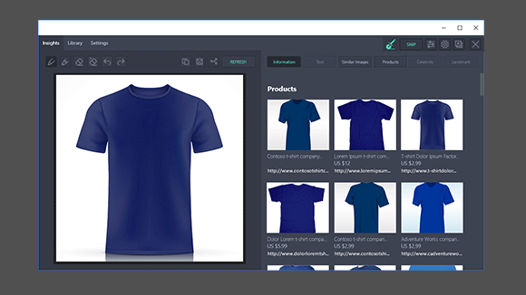
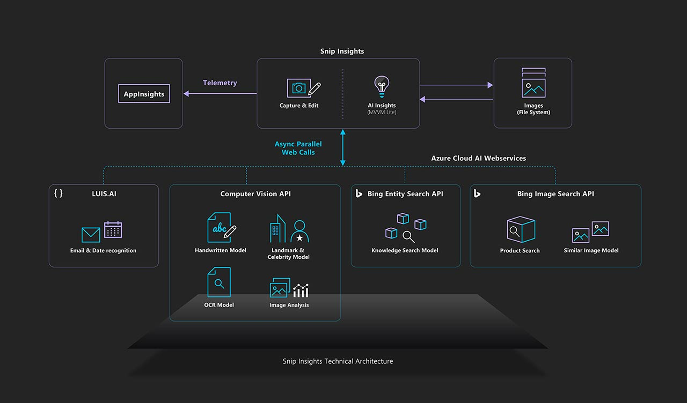

# Snip Insights Lab

Snip Insights is an open source cross-platform AI tool for intelligent screen capture. This solution leverages Microsoft Azure's Cognitive Services APIs to increase users' productivity by reducing the number of steps needed to gain intelligent insights. 

In this lab, we will be adding each service individually to observe how simple it is to consume just some of the many Cognitive Service Microsoft has to offer.

<p align="center">
  
</p>

## Architecture
<p align="center">
  
</p>


## Prerequisites
 * Universal Windows Platform (UWP)
 * Git
 * Visual Studio 2017 version 15.8 or later

## Setup Cognitive Service Resources

We will setup all the required Azure services first. Open Notepad to save each of the keys to be used later in the lab. 

### Setup your Azure subscription

This lab **requires** an Azure subscription.

If you need a new Azure subscription, then there are a couple of options to get a free subscription:

1. The easiest way to sign up for an Azure subscription is with VS Dev Essentials and a personal Microsoft account (like @outlook.com). This does require a credit card; however, there is a spending limit in the subscription so it won't be charged unless you explicitly remove the limit.

    * Open Microsoft Edge and go to the [Microsoft VS Dev Essentials site](https://visualstudio.microsoft.com/dev-essentials/).
    * Click **Join or access now**.
    * Sign in using your personal Microsoft account.
    * If prompted, click Confirm to agree to the terms and conditions.
    * Find the Azure tile and click the **Activate** link.

1. Alternatively, if the above isn't suitable, you can sign up for a free Azure trial.

    * Open Microsoft Edge and go to the [free Azure trial page](https://azure.microsoft.com/en-us/free/).
    * Click **Start free**.
    * Sign in using your personal Microsoft account.

1. Complete the Azure sign up steps and wait for the subscription to be provisioned. This usually only takes a couple of minutes.

### Create a Resource Group

1. Go to the [Azure Portal](https://portal.azure.com) and log in with your credentials.
1. Click **Create Resource [+]**  from the left menu and search for **Resource Group**.
1. Click **Create**
1. Provide the required information:
    * Resource group name: `ai-lab-snipinsights-<your initials>`.
    * Select your subscription.
    * Resource group location: `West US`.

### Entity Search API

Bing Entity Search API will identify the most relevant entity based on your searched term, spanning multiple entity types such as famous people, places, movies, TV shows, video games, books, and even local businesses near you.

1. Click **Create Resource [+]**  from the left menu and search for **Bing Entity Search**.
1. **Select** the first result and then click the **Create** button.
1. Provide the required information:
    * Name: `entity-search-<your initials>`.
    * Select your subscription.
    * Select the the Pricing tier: `F0 (20 Calls per minute, 5k Calls per month)`.
    * Select the previously created resource group: `ai-lab-snipinsights-<your initials>`.
    * Click on confirmation checkbox.
1. Click **Create** to create the resource and deploy it. This step might take a few moments.
1. Once the deployment is complete, you will see a **Deployment succeeded** notification.
1. Go to **All Resources** in the left pane and **search** for the new resource (`entity-search-<your initials>`).
1. **Click** on the resource.
1. Go to the **Keys** page.
1. Copy the **Key 1** value into **Notepad**.

    > NOTE: We'll need this key later on.

### Computer Vision API

Computer Vision provides developers with access to advanced machine learning models for analyzing images. Computer Vision algorithms can analyze the content of an image in different ways, depending on the visual features you're interested in.

1. Click **Create Resource [+]**  from the left menu and search for **Computer Vision**.
1. **Select** the first result and then click the **Create** button.
1. Provide the required information:
    * Name: `computer-vision-<your initials>`.
    * Select your subscription.
    * Select the location: `West US`.
    * Select the the Pricing tier: `F0 (20 Calls per minute, 5k Calls per month)`.
    * Select the previously created resource group: `ai-lab-snipinsights-<your initials>`.
1. Click **Create** to create the resource and deploy it. This step might take a few moments.
1. Once the deployment is complete, you will see a **Deployment succeeded** notification.
1. Go to **All Resources** in the left pane and **search** for the new resource (`computer-vision-<your initials>`).
1. **Click** on the resource.
1. Go to the **Keys** page.
1. Copy the **Key 1** value into **Notepad**.

    > NOTE: We'll need this key later.

### Bing Search v7 API

The Bing Search APIs add intelligent search to your app, combing hundreds of billions of webpages, images, videos, and news to provide relevant results with no ads. For this lab, we will be using Bing News Search.

1. Click **Create Resource [+]**  from the left menu and search for **Bing Search v7**.
1. **Select** the first result and then click the **Create** button.
1. Provide the required information:
    * Name: `bing-search-<your initials>`.
    * Select your subscription.
    * Select the the Pricing tier: `F0 (20 Calls per minute, 5k Calls per month)`.
    * Select the previously created resource group: `ai-lab-snipinsights-<your initials>`.
    * Click on confirmation checkbox.
1. Click **Create** to create the resource and deploy it. This step might take a few moments.
1. Once the deployment is complete, you will see a **Deployment succeeded** notification.
1. Go to **All Resources** in the left pane and **search** for the new resource (`bing-search-<your initials>`).
1. **Click** on the resource.
1. Go to the **Keys** page.
1. Copy the **Key 1** value into **Notepad**.

    > NOTE: We'll need this key later on.

### Translator Text API

Microsoft Translator API is a neural machine translation service that developers can easily integrate into their applications.

1. Click **Create Resource [+]**  from the left menu and search for **Translator Text**.
1. **Select** the *Translator Text* result and then click the **Create** button.
1. Provide the required information:
    * Name: `translator-text-<your_initials>`.
    * Subscritpion: your azure subscription.
    * Pricing tier: `F0 (2M Up to 2M characters translated)`.
    * Use existing resource group: `ai-lab-snipinsights-<your initials>`.
1. Click **Create**. This step might take a few seconds.
1. Once the deployment is complete, you will see a **Deployment succeeded** notification.
1. Go to **All Resources** in the left pane and **search** for the new resource (`translator-text-<your initials>`).
1. **Click** on the resource.
1. Go to the **Keys** page.
1. Copy the **Key 1** value into **Notepad**.

    > NOTE: We'll need this key later on.

### Content Moderator API

1. Return to the [Azure Portal](https://portal.azure.com).
1. Click **Create Resource [+]**  from the left menu and search for **Content Moderator**.
1. **Select** the first result and then click the **Create** button.
1. Provide the required information:
    * Name: `content-moderator-<your initials>`.
    * Select your subscription.
    * Select the location: `West US`.
    * Select the the Pricing tier: `F0 (20 Calls per minute, 5k Calls per month)`.
    * Select the previously created resource group: `ai-lab-snipinsights-<your initials>`.
1. Click **Create** to create the resource and deploy it. This step might take a few moments.
1. Once the deployment is complete, you will see a **Deployment succeeded** notification.
1. Go to **All Resources** in the left pane and **search** for the new resource (`content-moderator-<your initials>`).
1. **Click** on the resource.
1. Go to the **Keys** page.
1. Copy the **Key 1** value into **Notepad**.

    > NOTE: We'll need this key later on.

## Add Cognitive Services to your Solution

### Getting Started

1. Clone the Snip Insights Lab code from [GitHub](https://github.com/Microsoft/AISchoolTutorials)
1. Open `snipinsights/windows/Snipinsights.WPF.sln` and let Visual Studio prepare the solution.

### Add Generated Keys to the project

1. Open up the `APIKeys.cs` file in the root of the `Snipinsight` C# project.
1. Add the key you saved for `Entity Search API` as the **EntitySearchAPIKey**.
1. Add the key you saved for `Bing Search v7` as the **ImageSearchAPIKey**.
1. Add the key you saved for `Computer Vision` as the **ImageAnalysisAndTextRecognitionAPIKey**.
1. Add the key you saved for `Translator Text API` as the **TranslatorAPIKey**.
1. Add the key you saved for `Content Moderator API` as the **ContentModeratorAPIKey**.

### Computer Vision

In this section you will be using the Computer Vision API to identify celebrities and landmarks within the image taken using the application. The Computer Vision API can recognize more than 200,000 celebrities from business, politics, sports and entertainment, as well as 9,000 natural and manmade landmarks from around the world.

1. Open up **ImageAnalysisViewModel.cs** in `/AIServices/AIViewModels`.
1. Add the following code to the **LoadAnalysis** method by replacing the comment `//<add-image-analysis-here>`:

    ```cs
    var model = await _analysisHandler.GetResult(imageStream);
    ```

1. Open up **ImageAnalysisHandler.cs** in `/AIServices/AILogic`.
1. Add the following lines to define the working endpoint for the Image Analysis by replacing the comment `//<add-endpoint-details-here>`:

    ```cs
    Host = UserSettings.GetKey(key + "Endpoint", "westus.API.cognitive.microsoft.com/vision/v1.0");
    Endpoint = "analyze";
    RequestParams = "visualFeatures=Tags,Description&language=en&details=Celebrities,Landmarks";
    ```

    > NOTE: Notice we are passing Celebrities and Landmarks as a param to the Computer Vision endpoint

### Celebrity Search

If celebrities are detected using Computer Vision, we will call the Entity Search API to get further information and news about them.

1. Go back to **ImageAnalysisViewModel.cs** and replace the comment `//<add-get-celebrities-here>` in the **LoadAnalysis** method after the computer vision data has loaded:

    ```cs
    await GetCelebrities(model);
    ```

1. Also in the **LoadAnalysis** method, replace the comment `//<add-update-metadata-here>` with the following call to the **UpdateMetadata** method:

    ```cs
    UpdateMetadata(model);
    ```

1. Locate the **GetCelebrities** method and add the following code within the celebrities loop by replacing the comment `//<add-get-celebrities-logic-here>` to get the celebrity data from the **EntitySearchHandler**:

    ```cs
    // Get celebrity data from the Entity Search API
    var celebrityModel = await entityHandler.GetResult(celebrity.Name);
    if (celebrityModel.Entities != null)
    {
        var entry = celebrityModel.Entities.List.FirstOrDefault();

        if (entry != null)
        {
            // Create celebrity model for tag
            var celebModel = new CelebrityModel
            {
                Name = entry.Name,
                Image = entry.Image.URL,
                URL = entry.URL,
                Description = entry.Description
            };

            //<add-get-news-here>

            // Create face rectangle
            Rectangle rect = new Rectangle();
            rect.Tag = celebModel;

            rect.Width = celebrity.FaceRectangle.Width;
            rect.Height = celebrity.FaceRectangle.Height;
            rect.Stroke = unselectedStrokeBrush;
            rect.StrokeThickness = 2;
            rect.Fill = Brushes.Transparent;
            rect.ToolTip = entry.Name;
            rect.MouseDown += CelebritySelected;
            rect.MouseEnter += ShowCelebrityRectangle;
            rect.MouseLeave += HideCelebrityRectangle;

            celebrities.Children.Add(rect);
            Canvas.SetLeft(rect, celebrity.FaceRectangle.Left);
            Canvas.SetTop(rect, celebrity.FaceRectangle.Top);
        }
    }
    ```
    
    > NOTE: We are getting data from the Entity Search API for each of the celebrities recognized by the Computer Vision API, then we get news about them from a the News API.

1. Add the following code to get the news for each celebrity where the `//<add-get-news-here>` comment is in the previous code snippet:

    ```cs
    var result = await newsHandler.GetResult(celebrity.Name);

    celebModel.News = new ObservableCollection<NewsModel>(result.News);

    foreach(NewsModel newsModel in celebModel.News)
    {
        newsModel.DatePublished = newsModel.DatePublished.Substring(0, 10);
        newsModel.Description = newsModel.Description.Substring(0, 150) + "...";
    }
    ```

1. Open up **EntitySearchHandler.cs** in `/AIServices/AILogic` and add the following endpoint details in the constructor by replacing the comment `//<add-endpoint-details-here>`:

    ```cs
    Host = UserSettings.GetKey(keyFile + "Endpoint", "API.cognitive.microsoft.com/bing/v7.0");
    Endpoint = "entities";
    ```

1. Open up **NewsHandler.cs** in `/AIServices/AILogic` and add the following endpoint details in the constructor by replacing the comment `//<add-endpoint-details-here>`:
    
    ```cs
    Host = UserSettings.GetKey(keyFile + "Endpoint", "API.cognitive.microsoft.com/bing/v7.0");
    Endpoint = "news/search";
    ```

1. Look below for the **Run** method and replace the comment `//<add-endpoint-params-here>` with the following:
    ```cs
    RequestParams = "q=" + System.Net.WebUtility.UrlEncode(entityName);
    BuildURI();
    ```
1. Make sure you have saved all changes and start the application.
1. Look for a picture of `Satya Nadella` online, click `snip` and screenshot the picture.
1. Watch the application call the `Computer Vision` API to detect Satya and then the `Bing Search v7` API to collect information and news about him. 
1. Click stop on the toolbar within Visual Studio to stop debugging.

    > NOTE: You can place a breakpoint in the code at any of the API calls to inspect the raw results.

## Landmark search

If a landmark is detected in the image, we will call the Entity Search API to get the desired information about it.

1. Go back to **ImageAnalysisViewModel.cs** and add the following code to call the **LoadAnalysis** after getting the celebrities by replacing the comment `//<add-get-landmarks-here>`:

    ```cs
    await GetLandmarks(model);
    ```
1. Locate the **GetLandmarks** method in **ImageAnalysisViewModel.cs** and add the following code within the landmarks loop by replacing the comment `//<add-get-landmarks-logic-here>`:

    ```cs
    var landmarkModel = await entityHandler.GetResult(landmark.Name);

    var entry = landmarkModel.Entities.List.FirstOrDefault();

    if (entry != null)
    {
        landmarkList.Add(new LandmarkModel
        {
            Name = entry.Name,
            Image = entry.Image.URL,
            URL = entry.URL,
            Description = entry.Description,
            PostalCode = null,
            Telephone = null,
            Address = null
        });
    }
    ```
1. Make sure you have saved all changes and start the application.
1. Look for a picture of the `Seattle Space Needle` online, click `snip` and screenshot the picture.
1. Watch the application call the `Computer Vision` API to detect the landmark and then the `Bing Search v7` API to collect information about it.
1. Click stop on the toolbar within Visual Studio to stop debugging.

    > NOTE: You can place a breakpoint in the code at any of the API calls to inspect the raw results.


## Image Search

In this section you will be using Bing Image Search API v7 to scour the web for images that are similar to the image snip taken by the application. Results include full image URLs, image metadata, and thumbnails, which we will use to display in a list.

1. Open up **ImageSearchViewModel.cs** in `/AIServices/AIViewModels`.
1. Add the following code to the **LoadImages** method by replacing the comment `//<add-image-search-here>`:

    ```cs
    var model = await _handler.GetResult(imageStream);

    if (model != null && model.Container != null && model.Container.Images != null)
    {
        Images = new ObservableCollection<ImageSearchModel>(model.Container.Images);
        IsVisible = model.Container.Images.Count > 0 ? Visibility.Visible : Visibility.Collapsed;
        DynamicImageResizer.PopulateAspectRatioDict();
        DynamicImageResizer.CreateControlGallery(ImageMaxHeight, currentWrapPanelWidth);
    }
    ```

1. Open up **ImageSearchHandler.cs** in `/AIServices/AILogic`.
1. Add the following lines to define the working endpoint for Bing Image Search by replacing the comment `//<add-endpoint-details-here>`:

    ```cs
    Host = UserSettings.GetKey(keyFile + "Endpoint", "API.cognitive.microsoft.com/bing/v7.0");
    Endpoint = "images/details";
    RequestParams = "modules=SimilarImages";
    ```

    > NOTE: Notice we are establishing that we need similar images in the request params.

1. Locate the **Run** method and replace the comment `//<add-form-creation-logic-here>` with the following code that will take the image and generate form data content from it to be sent to the Bing API:

    ```cs
    var strContent = new StreamContent(stream);
    strContent.Headers.ContentDisposition = new ContentDispositionHeaderValue("form-data") { FileName = "AnyNameWorks" };

    var content = new MultipartFormDataContent();
    content.Add(strContent);
    ```

1. Finally, withing the same **Run** method, in the `try` statement, replace the comment `//<add-API-call-here>` with the following call to the Bing REST API:

    ```cs
    result = await RequestAndRetry(() => CloudServiceClient.PostAsync(URI, content));
    result.EnsureSuccessStatusCode();
    ```

1. Make sure you have saved all changes and start the application.
1. Look for a picture of the your favorite animal online, click `snip` and screenshot the picture.
1. Watch the application use the `Bing Search v7` image search API to get similar pictures of your favorite critter.
1. Click stop on the toolbar within Visual Studio to stop debugging.

    > NOTE: You can place a breakpoint in the code at any of the API calls to inspect the raw results.

## Product Search

In this section you will be using Bing Search API v7 again, however, this time to search the web for particular products that might be similar to the ones found in the snip taken by the application.

1. Open up **ProductSearchViewModel.cs** in `/AIServices/AIViewModels`.
1. Add the following code to the **LoadProducts** method by replacing the comment `//<add-product-search-call-here>`:

    ```cs
    var model = await _handler.GetResult(imageStream);

    if (model != null && model.Container != null && model.Container.Products != null)
    {
        Products = new ObservableCollection<ProductSearchModel>(model.Container.Products);
        IsVisible = Visibility.Visible;
        DynamicProductResizer.PopulateAspectRatioDict();
        DynamicProductResizer.CreateControlGallery(ImageMaxHeight, currentWrapPanelWidth);
    }
    ```

1. Open up **ProductSearchHandler.cs** in `/AIServices/AILogic`.
1. Add the following lines to define the working endpoint for Bing Image Search by replacing the comment `//<add-endpoint-details-here>`:

    ```cs
    Host = UserSettings.GetKey(keyFile + "Endpoint", "API.cognitive.microsoft.com/bing/v7.0");
    Endpoint = "images/details";
    RequestParams = "modules=SimilarProducts";
    ```

    > NOTE: Notice we are establishing that we need similar products in the request params.

1. Locate the **Run** method and replace the comment `//<add-API-call-here>` with the following code that will take the image, generate form data content from it, and send it to the Bing API:

    ```cs
    var strContent = new StreamContent(stream);
    strContent.Headers.ContentDisposition = new ContentDispositionHeaderValue("form-data") { FileName = "AnyNameWorks" };

    var content = new MultipartFormDataContent();
    content.Add(strContent);

    result = await RequestAndRetry(() => CloudServiceClient.PostAsync(URI, content));
    result.EnsureSuccessStatusCode();
    ```

1. Make sure you have saved all changes and start the application.
1. Look for a picture of the your favorite pair of shoes online, click `snip` and screenshot the picture.
1. Watch the application use the `Bing Search v7` product search API to get similar products of your favorite shoes.
1. Click stop on the toolbar within Visual Studio to stop debugging.

    > NOTE: You can place a breakpoint in the code at any of the API calls to inspect the raw results.

## Printed and Handwritten text recognition

In this section, you will leverage Computer Vision to detect text in an image using optical character recognition (OCR) and extract the recognized words into a machine-readable character stream.

1. Open up **OCRViewModel.cs** in `/AIServices/AIViewModels`.
1. Add the following code to the **LoadText** method by replacing the comment `//<add-handler-calls-here>`:

    ```cs
    Task<HandWrittenModel> writtenTask = writtenHandler.GetResult(writtenStream);
    Task<PrintedModel> printedTask = printedHandler.GetResult(printedStream);

    await Task.WhenAll(writtenTask, printedTask);
    CompareResult(writtenTask.Result, printedTask.Result);
    ```

1. Open up **PrintedTextHandler.cs** in `/AIServices/AILogic`.
1. Add the following lines to define the working endpoint for Computer Vision by replacing the comment `//<add-endpoint-details-here>`:

    ```cs
    Host = UserSettings.GetKey(keyFile + "Endpoint", "westus.API.cognitive.microsoft.com/vision/v1.0");
    Endpoint = "ocr";
    RequestParams = "language=unk&detectOrientation=true";
    ```

1. Open up **HandWrittenTextHandler.cs** in `/AIServices/AILogic`.
1. Add the following lines to define the working endpoint for Computer Vision by replacing the comment `//<add-endpoint-details-here>`:

    ```cs
    Host = UserSettings.GetKey(keyFile + "Endpoint", "westus.API.cognitive.microsoft.com/vision/v1.0");
    Endpoint = "recognizeText";
    RequestParams = "handwriting=true";
    ```

    > NOTE: Notice this is a different endpoint and we are establishing that we are looking for handwritten text in the request params.

1. Go back to **OCRViewModel.cs** and within the **CompareResults** method, replace the comment `//<add-text-comparison-here>` with the following:

    ```cs
    // Initialize string builder used to parse text from handwritten and OCR APIs
    StringBuilder result = new StringBuilder();

    try
    {
        // Concatenate line found by the handwriting recognition service
        foreach (LineWritten line in writtenModel.RecognitionResult.Lines)
        {
            result.Append(line.Text + "\n");
        }
    }
    catch (Exception)
    { }

    // Store handwriting service result
    string writtenResult = result.ToString() ?? string.Empty;

    // Clean string builder to be reused
    result.Clear();

    try
    {
        // Concatenate words recognized by the OCR service
        foreach (Region region in printedModel.Regions)
        {
            foreach (Line line in region.Lines)
            {
                foreach (Word word in line.Words)
                {
                    result.Append(word.Text + " ");
                }

                result.Append("\n");
            }
        }
    }
    catch (Exception)
    { }

    // Store OCR service result
    printedResult = result.ToString() ?? string.Empty;

    // Compare results to determine best match
    if (printedModel.Language != unknownLanguage && printedResult.Length > writtenResult.Length)
    {
        Text = printedResult;
        DetectedLanguage = printedModel.Language;
    }
    else
    {
        Text = writtenResult;
        DetectedLanguage = "en";
    }

    // Set default for no text detected
    if (string.IsNullOrWhiteSpace(text))
    {
        Text = "No Result";
    }
    else
    {
        //<add-enable-translation-logic-here>

        IsVisible = Visibility.Visible;
    }
    ``` 
    > NOTE: This piece of code will take the result of the Printed Text API and compare it to the Handwritten one to determine the best match. If the OCR service detected a language and the result is longer than the one produced by the handwriting service we can assure its a better match, otherwise, the handwriting result is used.

1. Make sure you have saved all changes and start the application.
1. Look for a picture of the your favorite quote in printed text online, click `snip` and screenshot the picture.
1. Watch the application use `Computer Vision` Printed Text API to gather the recognized text from the image.
1. Now, look for a picture of some handwritten text online, click `snip` and screenshot the picture.
1. Watch the application use `Computer Vision` Handwritten Text API to gather the recognized text from the image.
1. Click stop on the toolbar within Visual Studio to stop debugging.

    > NOTE: You can place a breakpoint in the code at any of the API calls to inspect the raw results.

## Translation

Once you have received the text from the API you can process additional tasks including obtaining a translation to one of the supported languages. Microsoft Translator API is a neural machine translation service that developers can easily integrate into their applications to provide multi-language support.

1. Go back to **OCRViewModel.cs** and look for the **CompareResults** method, replace the comment `//<add-enable-translation-logic-here>` with the following:
  
    ```cs
    TranslatorEnable = translationHandler.TranslatorEnable;

    if (TranslatorEnable)
    {
        Languages = PopulateLanguageMenus();
    }
    ```

1. Go to the **PopulateLanguageMenus** method and replace the `//<add-language-population-logic-here>` comment with the following:
  
    ```cs
    foreach (KeyValuePair<string, string> language in translationHandler.LanguageCodesAndTitles)
    {
      //Reversed to fetch detected language code.
      languages.Add(language.Value, language.Key);
    }

    if (!string.IsNullOrEmpty(DetectedLanguage) && !DetectedLanguage.Equals("unk"))
    {
      languages[DetectedLanguage] = languages[DetectedLanguage] + " (Detected)";
    }

    FromLanguage = DetectedLanguage;
    ```

1. Go to the **RunTranslation** method and replace the `//<add-translation-logic-here>` comment with the following:
  
    ```cs
    if (!string.IsNullOrEmpty(toLanguage) && !fromLanguage.Equals(toLanguage))
    {
        Task.Run(async () => TranslatedText = await translationHandler.GetResult(Text,
            FromLanguage,
            ToLanguage));
    }
    else
    {
        TranslatedText = Text;
    }
    ```

1. Open up **TranslationHandler.cs** in `/AIServices/AILogic`.
1. Add the following lines to define the endpoint host for the Translation API and fetch the available translating languages by replacing the comment `//<add-endpoint-host-and-get-languages-logic-here>` in the constructor with:

    ```cs
    // Define API Host
    Host = "API.microsofttranslator.com";

    // Initialize languages alphabetically ordered dictionary
    LanguageCodesAndTitles = new SortedDictionary<string, string>(
        Comparer<string>.Create((a, b) => string.Compare(a, b, true))
        );

    Task.Run(async () =>
    {
        try
        {
            // Get codes for languages available for translation
            await GetLanguagesForTranslate();

            // Gather names for each code and store in dictionary
            await GetLanguageNames();

            // Enable translation feature
            TranslatorEnable = true;
        }
        catch (WebException e)
        {
            Diagnostics.LogException(e);

            // Disable translation due to issue
            TranslatorEnable = false;
        }
    });
    ```

1. Look for the **GetLanguagesForTranslate** and replace the comment `//<add-endpoint-details-and-call-here>` with the following code to fetch the available translate languages:
  
    ```cs
    Endpoint = "/v2/Http.svc/GetLanguagesForTranslate";
    RequestParams = "scope=text";
    BuildURI();

    WebRequest request = WebRequest.Create(URI);
    request.Headers.Add("Ocp-APIm-Subscription-Key", this.Key);

    WebResponse response = await request.GetResponseAsync();

    using (Stream stream = response.GetResponseStream())
    {
        DataContractSerializer serializer = new DataContractSerializer(typeof(string[]));
        languageCodes = (string[])serializer.ReadObject(stream);
    }
    ```

1. Look for the **GetLanguageNames** and replace the comment `//<add-endpoint-details-and-call-here>` with the following code to fetch the available translate languages names:
  
    ```cs
    Endpoint = "/v2/Http.svc/GetLanguageNames";
    RequestParams = "locale=en";
    BuildURI();

    HttpWebRequest request = (HttpWebRequest)WebRequest.Create(URI);
    request.Headers.Add("Ocp-APIm-Subscription-Key", Key);
    request.ContentType = "text/xml";
    request.Method = "POST";

    DataContractSerializer serializer = new DataContractSerializer(typeof(string[]));
    using (Stream stream = request.GetRequestStream())
    {
        serializer.WriteObject(stream, languageCodes);
    }

    // Read and parse the XML response
    var response = await request.GetResponseAsync();

    string[] languageNames;
    using (Stream stream = response.GetResponseStream())
    {
        languageNames = (string[])serializer.ReadObject(stream);
    }

    // Load the dictionary for the combo box
    for (int i = 0; i < languageNames.Length; i++)
    {
        //Sorted by the language name for display
        LanguageCodesAndTitles.Add(languageNames[i], languageCodes[i]);
    }
    ```

1. Now find the **GetResult** method and add in the translation endpoint details by replacing the comment `//<add-endpoint-details-and-call-here>`: 
  
    ```cs
    Endpoint = "/v2/Http.svc/Translate";
    RequestParams = string.Format("text={0}&from={1}&to={2}",
        HttpUtility.UrlEncode(textToTranslate),
        fromLanguage,
        toLanguage);
    
    BuildURI();

    var webRequest = WebRequest.Create(URI);
    webRequest.Headers.Add("Ocp-APIm-Subscription-Key", Key);
    ```

1. Finally, within that same method in the try statement replace the comment `//<add-API-call-here>` to make the API call:

    ```cs
    WebResponse response = await webRequest.GetResponseAsync();

    using (StreamReader translatedStream = new StreamReader(response.GetResponseStream(), Encoding.GetEncoding("utf-8")))
    {
        String stringText = translatedStream.ReadToEnd();
        int startPos = stringText.IndexOf(">")+1;
        result = stringText.Substring(startPos, stringText.IndexOf("<", startPos) - startPos);
    }
    ```

1. Make sure you have saved all changes and start the application.
1. Look for a picture of the your favorite quote in english online, click `snip` and screenshot the picture.
1. Watch the application use Text Analytics to get the text from the image and then click on the `Translate` button.
1. The Translation API should have detected the language of the text which will be in the languages dropdown label `Language`.
1. Change the languages dropdown labeled `Translate to` to any other language and watch the Translation API fetch the correct translation.
1. Click stop on the toolbar within Visual Studio to stop debugging.

    > NOTE: You can place a breakpoint in the code at any of the API calls to inspect the raw results.

### Content Moderation

The Azure Content Moderator API is a cognitive service that checks text, image, and video content for material that is potentially offensive, risky, or otherwise undesirable. We will be implementing it before we call the previous services to handle flagged content in order to comply with regulations or maintain the intended environment for users.

1. Open  **AppManager.cs** at the root of the solution and moderate any shared emails by replacing `//<moderate-emails>` in the **OnShareEmailWithImage** method with the following:
    
    ```cs
        if (IsBlockedByContentModeration())
        {
            return;
        } 
    ```

1. Open  **ContentModerationHandler.cs** in `/AIServices/AILogic` and add the following endpoint details in the **BuildURI** method by replacing the comment `//<add-endpoint-details-here>`:
    
    ```cs
        Scheme = "https",
        Host = "westus.api.cognitive.microsoft.com/contentmoderator",
        Path = "moderate/v1.0/ProcessImage/Evaluate",
        Query = "CacheImage=true"
    ```
1. Locate the **ParseModel** method in **ContentModerationHandler.cs** and add the following logic to moderate content by replacing the comment `//<add-moderator-logic-here`:
    
    ```cs
        if (model.AdultClassificationScore > AdultClassificationScoreMin)
            return true;
        if (model.RacyClassificationScore > RacyClassificationScoreMin)
            return true;
    ```

    > NOTE: You can adjust the threshold of what is considered adult/racy content by adjusting either the **AdultClassificationScoreMin** or **RacyClassificationScoreMin** constants at the head of the file.

1. Make sure you have saved all changes and start the application.
1. Search for an image of racy content online. An example of this could be someone wearing a bathing suit.
1. In the snip insights UI, try to send the image via email by clicking the **share** icon.
1. Watch the application call the `Content Moderator` API, detect the racy content and warn you about proceeding.
1. Click stop on the toolbar within Visual Studio to stop debugging.

    > NOTE: You can place a breakpoint in the code at any of the API calls to inspect the raw results.


End of Lab

## Licenses

This project uses some third-party assets with a license that requires attribution:

- [Xam.Plugins.Settings](https://github.com/jamesmontemagno/SettingsPlugin): by James Montemagno
- [DynamicStackLayout](https://github.com/SuavePirate/DynamicStackLayout): by SuavePirate
- [Nerdbank.GitVersioning](https://github.com/aarnott/Nerdbank.GitVersioning): by Andrew Arnott 
- [Newtonsoft.Json](https://www.newtonsoft.com/json): by James Newton-King
- [Polly](https://github.com/App-vNext/Polly): by Michael Wolfenden
- [Refit](https://github.com/reactiveui/refit): by Paul Betts
- [SixLabors.ImageSharp](https://github.com/SixLabors/ImageSharp): by Six Labors

## Code of Conduct

This project welcomes contributions and suggestions.  Most contributions require you to agree to a
Contributor License Agreement (CLA) declaring that you have the right to, and actually do, grant us
the rights to use your contribution. For details, visit https://cla.microsoft.com.

When you submit a pull request, a CLA-bot will automatically determine whether you need to provide
a CLA and decorate the PR appropriately (e.g., label, comment). Simply follow the instructions
provided by the bot. You will only need to do this once across all repos using our CLA.

This project has adopted the [Microsoft Open Source Code of Conduct](https://opensource.microsoft.com/codeofconduct/).
For more information see the [Code of Conduct FAQ](https://opensource.microsoft.com/codeofconduct/faq/) or
contact [opencode@microsoft.com](mailto:opencode@microsoft.com) with any additional questions or comments.
